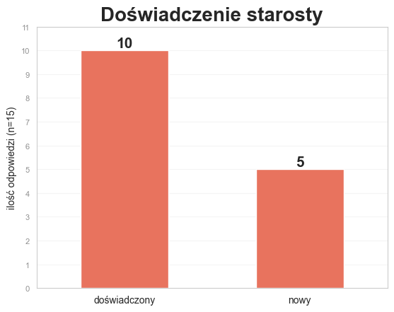
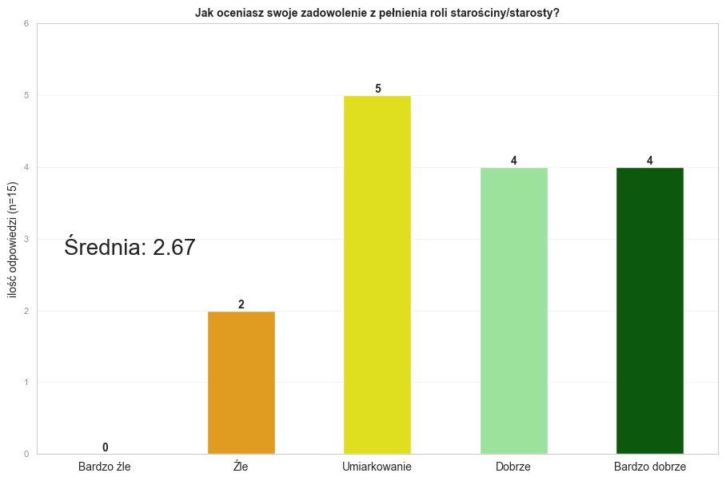
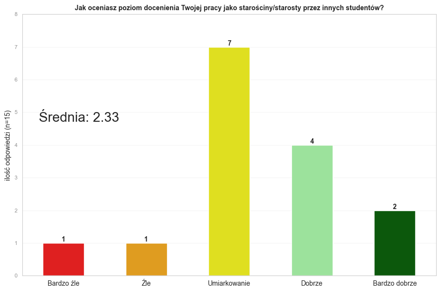
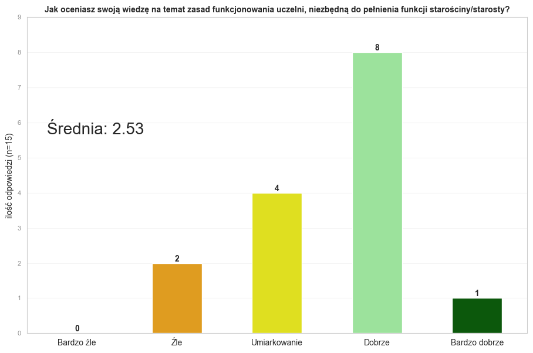
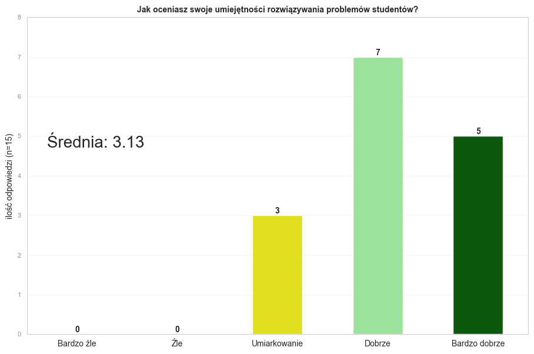
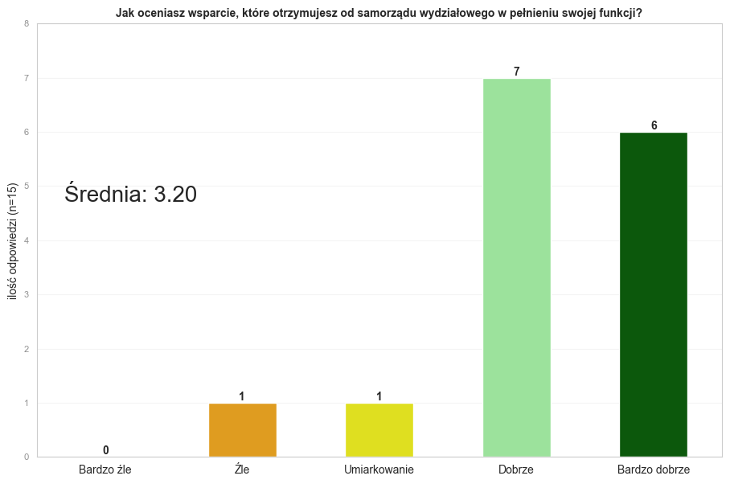
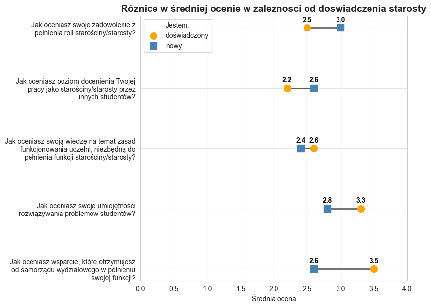

# badanie-starostow-2024  

Repository contains data and results of a rapid satisfactory research on Student Council representatives.

## Insights gathered from pool data ([data.xlsx](data.xlsx)) and visualized via python programming language in *Interactive PYthon NoteBook* file ([pool_summary.ipynb](pool_summary.ipynb))

  
___
  
  
  
  
  
  
  
  
  
___
  

Krzysztof Tomasz Stawarz, WRSS WH  
Kraków, 28.10.2024  
